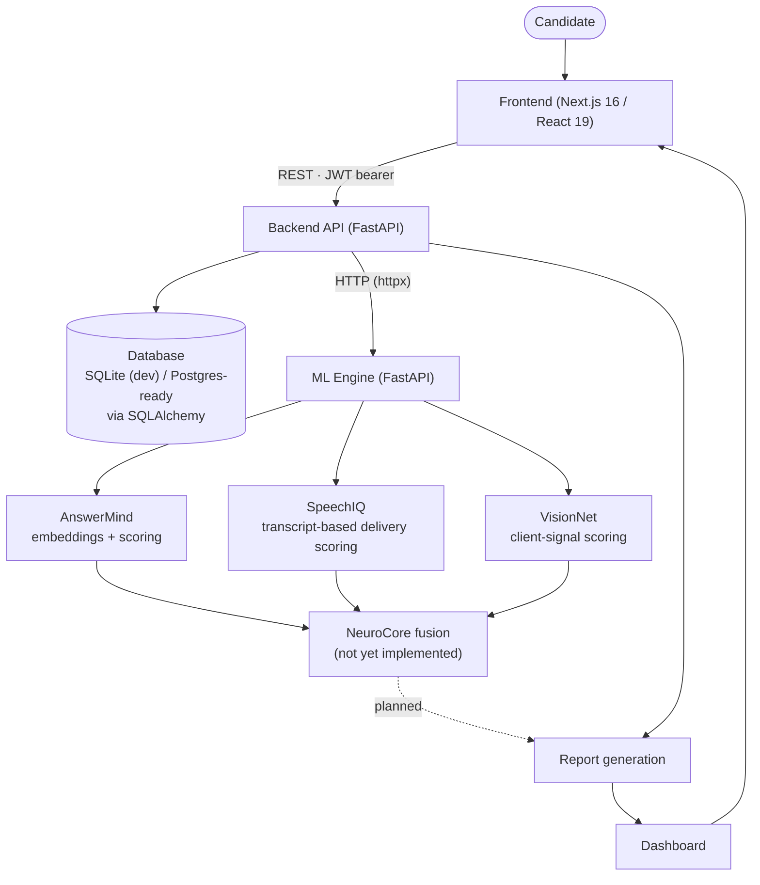

# NeuroHire AI

Multimodal AI interview intelligence — evaluating what candidates say, how they say it, and how they present, in one platform.

[](#license)
[](backend/requirements.txt)
[](backend/requirements.txt)
[](frontend/package.json)
[](frontend/package.json)
[](frontend/tsconfig.json)
[](#contributing)

---

## Overview

NeuroHire AI is a full-stack platform that runs a candidate through a structured mock interview and scores the response across three independent dimensions: **what was said** (content quality), **how it was said** (delivery), and **how it was presented** (visual communication). Each dimension is handled by its own ML module, and the system is built so those modules can evolve independently of the web application around them.

The project exists as a demonstration of production-style engineering — typed contracts between frontend and backend, a decoupled inference service, background-task processing so ML analysis never blocks the user, and an explicit, honest data model that distinguishes "not yet scored" from "scored zero." It's aimed at engineers who want to see a realistic multi-service AI product, not a single-file LLM wrapper.

## Features

### Authentication
- Email/password signup and login issuing signed JWTs (`python-jose`, HS256)
- Passwords hashed with `bcrypt` directly (not `passlib`, to avoid its incompatibility with modern bcrypt releases)
- `GET /auth/me` and all interview/session/report/dashboard routes are protected via a bearer-token dependency

### Interview Platform
- Interviews are created against a role track (SWE, ML, Data Analyst, Product Manager), experience level, difficulty, and interview type (technical, behavioral, mixed)
- Questions are seeded from a deterministic, versioned static question bank at creation time — no randomness, fully reproducible
- A session flow serves one question at a time, tracks progress, and accepts an answer per question
- In-browser speech-to-text via the Web Speech API, live webcam capture, and real-time face tracking via MediaPipe's `FaceLandmarker` (eye-contact ratio, posture, and movement are derived client-side per frame and summarized before submission)

### Dashboard
- Aggregate stats (total interviews, average score, score delta between first and most recent scored session)
- Skill breakdown and performance-over-time series, computed only from interviews whose report is `ready`
- Interviews still pending analysis are excluded rather than backfilled with placeholder numbers

### Reports
- Per-interview NeuroScore, radar chart data, per-module breakdown, and generated feedback (strengths / areas to improve)
- Report status is either `pending` or `ready`; the frontend polls a stable resource rather than guessing

### Backend
- Layered FastAPI service: routes → services → SQLAlchemy models, with Pydantic schemas as the request/response boundary
- Answer submission is split into a fast synchronous path (validate, persist, return) and a `BackgroundTasks`-dispatched analysis path, so the client can move to the next question immediately instead of waiting on inference
- The background task opens its own DB session and calls all three ML clients concurrently via `ThreadPoolExecutor`, passing only primitive values (never ORM objects) across the thread boundary

### AI/ML
- **AnswerMind** — scores relevance, technical correctness, clarity, structure, and completeness from a transcript, using sentence-embedding similarity plus rule-based linguistic scoring, and generates targeted written feedback
- **SpeechIQ** (implemented as `speechmind`) — scores pace, confidence, filler-word control, and delivery directly from the transcript text and reported duration (no raw audio signal processing)
- **VisionNet** (implemented as `visionmind`) — scores eye contact, body language, confidence, and presence from client-computed vision signals (face-detected flag, eye-contact ratio, posture score, movement level)
- **NeuroCore**, the fusion layer that combines all three modules into a final NeuroScore, is defined as a typed contract (`NeuroCoreClient.fuse`) but not yet implemented — it explicitly raises `NotImplementedError` pending its own ml-engine service

### Frontend
- Next.js 16 App Router, React 19, TypeScript, Tailwind CSS 4
- A single typed API client (`lib/api.ts`) wraps every backend call, handles auth headers, and normalizes FastAPI's error shape into one `ApiError` type
- Recharts-based dashboard visualizations, `framer-motion` for interview-room animation

### Security
- JWT-based auth with expiring access tokens
- Bcrypt password hashing with explicit 72-byte truncation handling
- Pydantic request validation on every endpoint (e.g. score fields constrained to 0–100, ratios to 0–1)
- Ownership checks on interviews/reports so one user cannot fetch another user's data by guessing an ID

### Performance
- ML inference dispatched as a background task, decoupled from the request/response cycle
- Concurrent execution of the three ML module calls via a thread pool instead of sequential HTTP round-trips
- Cached embedding model load (`lru_cache`) and cached settings accessor in the backend

## Architecture



The frontend never talks to the ML engine directly. The backend owns persistence and orchestration: it accepts an answer, stores it immediately, and dispatches analysis to the ML engine as a background task. Each ML module is a self-contained FastAPI router mounted on the standalone `ml-engine` service, callable independently of the main backend. Today, AnswerMind, SpeechIQ, and VisionNet each return real scores; the NeuroCore fusion step that would combine them into a final NeuroScore is done today with a straightforward per-question average in the backend's `report_service`, not by a dedicated fusion model — the `NeuroCoreClient` contract exists for when that becomes a real service.

## Tech Stack

| Category | Technology | Purpose |
|---|---|---|
| Frontend framework | Next.js 16 (App Router), React 19 | UI, routing, dashboard/report/interview pages |
| Frontend language | TypeScript | Type-safe components and API contracts |
| Styling | Tailwind CSS 4 | Utility-first styling, shadcn-style components |
| Charts | Recharts | Dashboard performance and skill-breakdown charts |
| Animation | Framer Motion | Interview-room transitions |
| Computer vision (client) | `@mediapipe/tasks-vision` (FaceLandmarker) | Real-time face landmark detection for eye contact/posture/movement signals |
| Speech-to-text (client) | Web Speech API | Live transcript capture during interviews |
| Backend framework | FastAPI | REST API, dependency injection, background tasks |
| ORM | SQLAlchemy 2.0 | Declarative models, relationships, sessions |
| Migrations | Alembic | Schema migration tooling (configured; no committed migrations yet) |
| Database | SQLite (dev default), Postgres-ready | Persistence — swappable via `DATABASE_URL` |
| Auth | `python-jose`, `bcrypt` | JWT issuance/verification, password hashing |
| HTTP client | `httpx` | Backend → ML engine calls |
| ML engine framework | FastAPI | Independent inference service |
| NLP | `sentence-transformers` (`all-MiniLM-L6-v2`) | Semantic similarity between question and transcript (AnswerMind) |
| ML tooling | `torch`, `transformers`, `scikit-learn`, `numpy` | Embedding model runtime and supporting numerical operations |

## Project Structure

```text
neurohire-ai/
├── frontend/                     # Next.js 16 application
│   ├── app/                      # App Router pages: landing, login, signup, dashboard,
│   │                              interview/create, interview/room, report, profile
│   ├── components/                # UI grouped by domain: auth/, dashboard/, interview/,
│   │                              report/, marketing/, profile/, app/ (shell/sidebar), ui/
│   └── lib/                       # api.ts (typed API client), mock-data.ts (marketing/
│                                   decorative placeholders), utils.ts
├── backend/                       # FastAPI application
│   ├── app/
│   │   ├── api/v1/                # Route modules: auth, interviews, sessions, reports, dashboard
│   │   ├── core/                  # Settings (pydantic-settings) and security (JWT/bcrypt)
│   │   ├── db/                    # Declarative base, mixins, engine/session factory
│   │   ├── models/                # SQLAlchemy models: User, Interview, Question, Answer, Report
│   │   ├── schemas/                # Pydantic request/response contracts
│   │   ├── services/               # Business logic: interview, session, report, dashboard,
│   │   │                          question_bank
│   │   └── ml_clients/             # Typed HTTP clients + dataclass contracts for each ML module
│   └── migrations/                 # Alembic environment (no versioned migrations committed yet)
├── ml-engine/                      # Standalone FastAPI inference service
│   └── app/
│       ├── answermind/              # Embeddings, preprocessing, scoring, router, service
│       ├── speechmind/               # Transcript-based delivery scoring, router, service
│       └── visionmind/                # Client-signal-based visual scoring, router, service
└── docs/                            # ARCHITECTURE.md, API_DESIGN.md, ML_PIPELINE.md
```

## API Overview

Base prefix: `/api/v1`

| Method | Route | Purpose | Auth Required |
|---|---|---|---|
| POST | `/auth/signup` | Create a user and return a JWT | No |
| POST | `/auth/login` | Authenticate and return a JWT | No |
| GET | `/auth/me` | Return the current authenticated user | Yes |
| POST | `/interviews` | Create an interview and seed its questions | Yes |
| GET | `/interviews` | List the current user's interviews | Yes |
| GET | `/interviews/{interview_id}` | Get one interview (ownership-checked) | Yes |
| GET | `/sessions/{interview_id}/question` | Get the next unanswered question | Yes |
| POST | `/sessions/{interview_id}/answer` | Submit an answer; dispatches ML analysis in the background | Yes |
| POST | `/sessions/{interview_id}/finish` | Mark the interview complete and create/update its report | Yes |
| GET | `/reports/{interview_id}` | Get the report for an interview | Yes |
| GET | `/dashboard/summary` | Get aggregated dashboard data for the current user | Yes |
| GET | `/health` | Service health check | No |

The ML engine (a separate service, default `http://127.0.0.1:8001`) exposes its own internal routes — `/answermind/analyze`, `/speechmind/analyze`, `/visionmind/analyze` — called by the backend's `ml_clients`, not by the frontend.

## Authentication Flow

```
Signup (POST /auth/signup)
        ↓
Password hashed with bcrypt, user row created
        ↓
JWT issued (subject = user id, HS256, configurable expiry)
        ↓
Frontend stores the token and attaches it as a Bearer header on every request
        ↓
Backend's get_current_user dependency decodes the token, loads the user,
rejects expired/invalid tokens or inactive accounts (401)
```

Login follows the same shape, verifying the submitted password against the stored bcrypt hash instead of creating a new user.

## Data Flow

1. **Create** — the user configures a role, experience level, difficulty, and interview type; the backend creates an `Interview` row and seeds `Question` rows from the static question bank.
2. **Answer** — the session flow serves one question at a time. The frontend captures a transcript (Web Speech API) and vision signals (MediaPipe face landmarks, summarized into an eye-contact ratio, posture score, and movement level) and posts them to `/sessions/{id}/answer`.
3. **Persist fast, analyze slow** — the route persists the `Answer` row synchronously and returns immediately, then schedules `analyze_answer_background` as a FastAPI background task.
4. **Concurrent analysis** — the background task calls AnswerMind, SpeechIQ, and VisionNet concurrently (thread pool), storing each module's raw JSON result on the `Answer` row, or a `{"status": "failed"}` marker if a call errors.
5. **Finish** — once every question is answered, `/sessions/{id}/finish` marks the interview `completed` and builds (or refreshes) the interview's `Report`.
6. **Report** — the report is populated by averaging each module's per-question scores into a NeuroScore, a radar chart, a per-module breakdown, and short feedback strings, only once every question's AnswerMind analysis is complete; otherwise the report stays `pending`.
7. **Dashboard** — aggregate stats and charts are computed from `ready` reports only.

## AI / Evaluation Pipeline

- **AnswerMind** (implemented): computes sentence-embedding similarity between the question and transcript using `sentence-transformers/all-MiniLM-L6-v2`, then derives relevance, technical correctness, clarity, structure, and completeness through rule-based scoring functions layered on top of that similarity and basic text statistics (sentence length, vocabulary variety, keyword presence). Feedback is generated by rule-based templates keyed off the computed scores — there is no LLM call in this module.
- **SpeechIQ / SpeechMind** (implemented): scores are derived entirely from the transcript text and reported duration — words-per-minute pacing, filler-word and hesitation-phrase detection, sentence-length variance, and repetition rate. There is no audio waveform or prosodic (pitch/energy) analysis; "speech" analysis here is text-based.
- **VisionNet / VisionMind** (implemented): scores are computed from client-summarized signals (face-detected ratio, eye-contact ratio, posture score, movement level) that the frontend derives per-frame from MediaPipe's `FaceLandmarker` during the interview. The ML engine itself does not process video frames — it scores the pre-computed signals it receives.
- **NeuroCore fusion**: the typed client contract (`NeuroCoreClient.fuse`) exists in `backend/app/ml_clients/`, but currently raises `NotImplementedError` and has no corresponding route in `ml-engine`. The NeuroScore shown in reports today is computed by simple averaging inside the backend's `report_service`, not by a dedicated fusion model.

## Engineering Decisions

- **Typed API client on the frontend** (`lib/api.ts`) centralizes every fetch call, error normalization, and auth-header logic in one place, so components never construct requests manually.
- **Layered backend** (routes → services → models) keeps route handlers thin; business logic and validation errors live in `services/`, making them independently testable with FastAPI's `TestClient`.
- **Dataclass I/O contracts for ML clients** (`ml_clients/schemas.py`) are framework-agnostic on purpose, so the same shapes can be reused directly by the standalone `ml-engine` service without a Pydantic dependency leaking into that boundary.
- **Fast-path/background-path split for answer submission** avoids making the candidate wait on model inference mid-interview, at the cost of a documented race condition (see below) that a future fix will close by re-checking report completion after each background task finishes.
- **Primitives-only across the background-task boundary** — the background task never receives a SQLAlchemy object or the request-scoped session, because SQLAlchemy ORM instances aren't thread-safe and the original session is closed by the time the task runs.
- **Denormalized display labels** (`role_label`, `difficulty_label` on `Interview`) avoid a join purely to render "ML Engineer" or "Advanced" in list views.

## Security

- Passwords are hashed with `bcrypt` (never stored or logged in plaintext); a documented 72-byte truncation matches bcrypt's own input limit.
- Access tokens are signed JWTs with a configurable expiry (`ACCESS_TOKEN_EXPIRE_MINUTES`), verified on every protected route via a shared dependency.
- All request bodies are validated by Pydantic schemas — numeric scores and ratios are range-constrained at the schema level (e.g. `ge=0, le=100`).
- Interview and report lookups are always scoped to `current_user.id`, so one account cannot enumerate or read another account's data by guessing an ID.
- `SECRET_KEY` and `DATABASE_URL` are read from environment variables via `pydantic-settings`, never hardcoded outside `core/config.py`.

## Performance

- Answer submission returns to the client before ML inference runs, via FastAPI `BackgroundTasks`.
- AnswerMind, SpeechIQ, and VisionNet analysis for a single answer run concurrently in a `ThreadPoolExecutor`, not sequentially.
- The sentence-embedding model is loaded once and cached with `@lru_cache`, avoiding repeated model loads per request.
- Application settings are cached via `@lru_cache` rather than re-read from the environment on every request.

## Setup

### Requirements
- Python 3.11+
- Node.js 20+
- pnpm (frontend lockfile is `pnpm-lock.yaml`) or npm

### Clone
```bash
git clone https://github.com/codebyshambhavi/neurohire-ai.git
cd neurohire-ai
```

### Backend setup
```bash
cd backend
python -m venv .venv
source .venv/bin/activate      # Windows: .venv\Scripts\activate
pip install -r requirements.txt
cp .env.example .env           # then fill in a real SECRET_KEY
uvicorn app.main:app --reload --port 8000
```
The dev lifespan hook calls `Base.metadata.create_all()` automatically when `ENVIRONMENT` is not `production`, so no manual migration step is required for local development. SQLite (`neurohire.db`) is the default; set `DATABASE_URL` to a Postgres DSN for anything beyond local dev.

### ML engine setup
```bash
cd ml-engine
python -m venv .venv
source .venv/bin/activate
pip install -r requirements.txt
uvicorn app.main:app --reload --port 8001
```
First startup downloads and caches the `all-MiniLM-L6-v2` sentence-transformer model.

### Frontend setup
```bash
cd frontend
pnpm install     # or: npm install
pnpm dev         # or: npm run dev
```
By default the frontend expects the backend at `http://127.0.0.1:8000`; override with the `NEXT_PUBLIC_API_URL` environment variable if needed.

### Environment variables (backend)
| Variable | Default | Purpose |
|---|---|---|
| `ENVIRONMENT` | `development` | Gates dev-only behavior like `create_all` |
| `DATABASE_URL` | `sqlite:///./neurohire.db` | SQLAlchemy connection string |
| `SECRET_KEY` | *(dev placeholder — change this)* | JWT signing secret |
| `JWT_ALGORITHM` | `HS256` | JWT signing algorithm |
| `ACCESS_TOKEN_EXPIRE_MINUTES` | `1440` | Token lifetime |
| `CORS_ORIGINS` | `http://localhost:3000,http://127.0.0.1:3000` | Allowed frontend origins |
| `ML_ENGINE_URL` | `http://127.0.0.1:8001` | Base URL for the ML engine service |
| `ML_ENGINE_TIMEOUT_SECONDS` | `120` | Timeout for ML engine calls |

### Development workflow
Run all three services locally (`ml-engine` on 8001, `backend` on 8000, `frontend` on 3000) — the backend needs the ML engine reachable for analysis to complete rather than fail. FastAPI's `TestClient` is used for backend smoke tests during development.

## Example Workflow

```
Sign up / log in
        ↓
Create an interview (role, experience level, difficulty, type)
        ↓
Answer each question in the session (speech captured live, webcam tracked)
        ↓
Backend persists the answer instantly, analysis runs in the background
        ↓
Finish the interview → report is generated once analysis for every
question has completed
        ↓
Dashboard updates with the newly scored interview
```

## Screenshots

_Screenshots to be added._

## Future Improvements

- Implement the NeuroCore fusion service so NeuroScore reflects a purpose-built fusion model rather than a plain average
- Close the race condition where a report can remain `pending` indefinitely if the interview is finished before the last answer's background analysis completes
- Add real audio-signal processing (pitch, energy, pause detection) to SpeechIQ instead of scoring from transcript text alone
- Commit versioned Alembic migrations instead of relying on `create_all()` for schema management
- Add CI (lint + backend tests) and a Dockerized dev environment for the three services
- OAuth login options alongside email/password
- Export functionality for reports (PDF/CSV)

## Contributing

Issues and pull requests are welcome. Before opening a PR:
1. Open an issue describing the change if it's more than a small fix.
2. Keep backend changes consistent with the existing layered structure (routes stay thin; logic lives in `services/`).
3. Keep ML module contracts (`ml_clients/schemas.py`) framework-agnostic.
4. Run the backend smoke tests (`TestClient`) before submitting.
5. Match existing naming conventions (AnswerMind / SpeechIQ / VisionNet / NeuroCore).

## License

This project is licensed under the MIT License. See the LICENSE file for details.